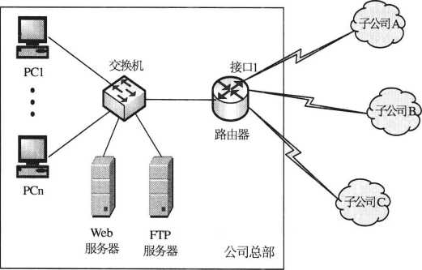
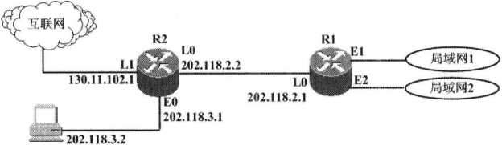
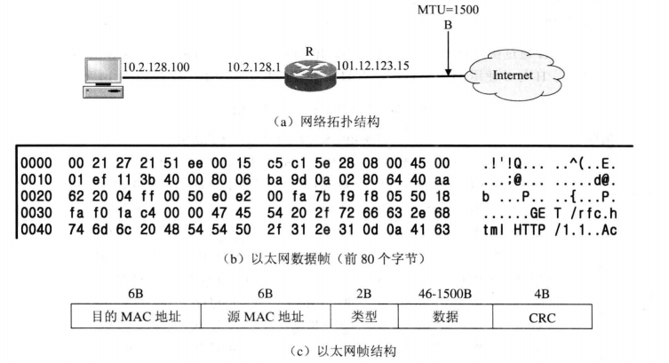
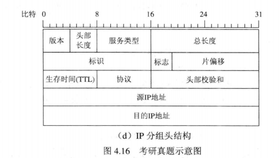

# Homework for the 11th

#### 作业

1.某公司总部和3个子公司分别位于4个地方，网络结构如图4.14所示，公司总部要求主 机数为50台，子公司A要求主机数为25台，子公司B要求主机数为10台，子公司C要求主机 数为10台。该公司用一个地址块202.119.110.0/24组网，请完成如表4.8所示标出的①〜⑥处的主 机地址或者子网掩码。

图4.14网络结构图

表4.8各部门的主机地址范围和子网掩码

|   部门    |   可分配的地址范围	|   子网掩码    |
| :-------: |    :-------------:    |  :-------:    |
|   公司总部    |   202.119.110.129-①	|   255.255.255.192 |
|   子公司A |   ©~202.119.110.94	|   ③   |
|   子公司B	|   202.119.110.97-④	|   255.255.255.240 |
|   子公司C	|   ⑤〜⑥	|   255.255.255.240

解：各部门的主机地址范围和子网掩码如表4.9所示。

表4.9各部门的主机地址范围和子网掩码

|   部门	|   可分配的地址范围	|   子网掩码    |
|  :----:   |    :------------:  |   :--------: |
|   公司总部	|   202.119.110.129-202.119.110.190	|   255.255.255.192 |
|   子公司A	|   202.119.110.65-202.119.110.94	|   255.255.255.224 |
|   子公司B	|   202.119.110.97-202.119.110.110	|   255.255.255.240 |
|   子公司C	|   202.119.110.113-202.119.110.126	|   255.255.255.240 |

2.某网络拓扑如图4.15所示，路由器R1通过接口 El、E2分别连接局域网1、局域网2,通过 接口 L0连接路由器R2,并通过路由器R2连接域名服务器与互联网。R1的L0接口的IP地址是 202.118.2.1； R2 的 L0 接口的 IP 地址是 202.118.2.2, L1 接口的 IP 地址是 130.11.120.1, E0 接口的 IP 地址是202.118.3.1；域名服务器的IP地址是202.118.3.2。

图4.15示意图 域名服务器

R1和R2的路由表结构如表4.10所示。

表4.10路由表结构

|   目的网络IP地址	|   子网掩码    |   下一跳IP地址	|   接口    |
|   :-----------: |   :-------: |   :----------:   |   :-----: | 

(1)将IP地址空间202.118.1.0/24划分为2个子网，分别分配给局域网1、局域网2,每个局域 网需要分配的IP地址数不少于120个。请给出子网划分结果，说明理由或给出必要的计算过程。

(2)请给出R1的路由表，使其明确包括到局域网1的路由、局域网2的路由、域名服务器 的主机路由和互联网的路由。

(3)请采用路由聚合技术，给出R2到局域网1和局域网2的路由。

3.某主机的MAC地址为00-15-C5-C1-5E-28, IP地址为10.2.128.100 (私有地址)。

图 4.16 (a)是网络拓扑，(b)是该主机进行Web请求的1个以太网数据帧的前80个字节的十六进行及ASCII码内容。

请参考图中的数据回答以下问题。

(1)Web服务器的IP地址是什么？该主机的默认网关的MAC地址是什么？

(2)该主机在构造如图4.16 (b)所示的数据帧时，使用什么协议确定目的MAC地址？封装 协议请求报文的以太网帧的目的MAC地址是什么？

(3)假设HTTP/1.1协议以持续的非流水线方式工作，一次请求-响应时间为RTT, rfc.html 网页引用了 5个JPEG小图像，则从发出如图4.16 (b)所示的Web请求开始到浏览器收到全部内 容为止，需要多少个RTT?

(4)该帧所封装的IP分组经过路由器R转发时，需修改IP分组头中的哪些字段？

