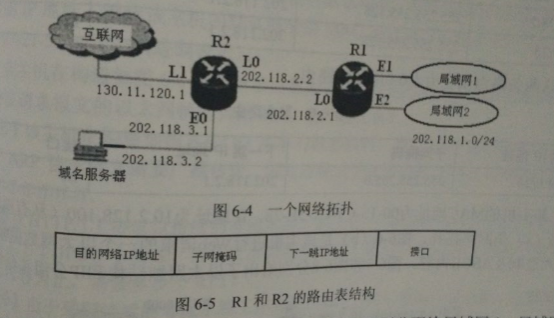
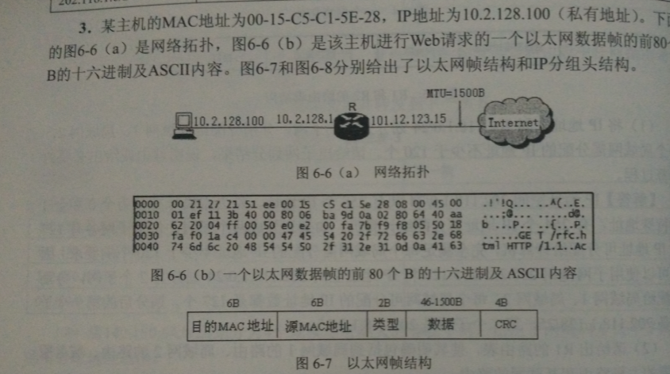
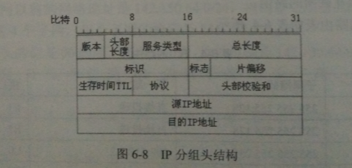
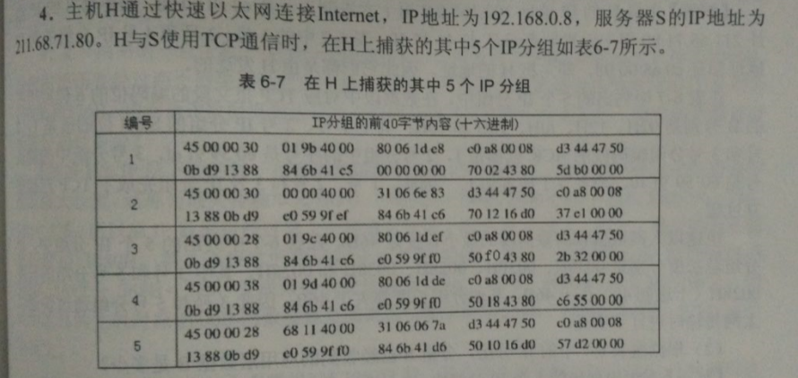
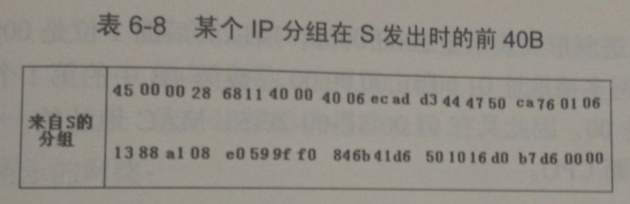

# Homework for the 13th

#### 作业

作业1 ： 某路由器具有下表所示路由表

    网络地址/前缀长度	  下一跳

142.150.64.0/24	A

142.150.71.128/28	B

142.150.71.128/30	C

142.150.0.0/16	D

问题1： 假设路由器收到一个目的地址为142.150.71.132的IP分组，请确定该路由器为该分组选择的下一跳，并说明原因。

问题2：在上面的路由表中增加一条路由记录，该路由记录使得以142.150.71.132/32为目的地址的IP分组选择A为下一跳，而不影响其他目的地址的IP分组转发。

问题3：在上面的路由表中增加一条路由记录，使得所有目的地址与该路由表中任何路由记录均不匹配的IP分组被转发给E路由器。

问题4： 将142.150.64.0/24划分为4个规模尽可能大的等大小子网，给出子网掩码、每个子网的网络地址、直接广播地址、可分配的IP地址。

作业2：某网络的网络拓扑结构如下图所示。

路由器R1通过接口E1,E2分别于局域网1，局域网2相连；通过接口L0连接路由器R2，通过理由起R2连接DNS服务器与互联网。R1，R2路由器路由表接口如下表所示。

目的网络地址	子网掩码	下一跳IP地址	 接口
问题1： 强IP地址空间202.118.1.0/24划分为2个子网，分别分配给局域网1，局域网2，每个局域网需要的IP地址不少于120个。请给出子网划分结果，并说明理由。

问题2：请给出R1路由表，使得明确包括到达局域网1的路由、局域网2的路由、DNS服务器的主机路由和互联网的路由。

作业3如下

问题1： WEB服务器的IP地址是什么？该主机的默认网关的MAC地址是什么？

问题2：该主机在构造数据帧时，采用什么协议确定目的MAC地址，该协议请求报文目的MAC地址是什么？

问题3：假设HTTP/1.1协议以非流水线方式工作，一次请求-响应时间为RTT，rfc.htm网页引用了5个JPEG小图像，则从6-6（b）所示的WEB请求到浏览器收到全部内容为至，需要多少个RTT?

作业4如下

问题1： 表6-7中的IP分组中，哪几个是由H发送的？哪几个完成了TCP连接建立过程？那几个在通过快速以太网传输时进行填充？

问题2：根据表6-7中的IP分组，分析S已经收到的应用层数据B是多少？

问题3： 如果表6-7中某个IP分组在S发出时的前40B如表6-8所示，则该IP分组到达H时进过了多少个路由器？

作业5（距离矢量路由算法应用题目），具体如下

