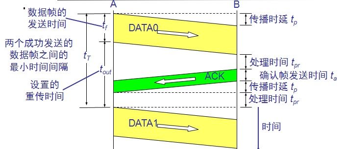

# Homework for the 7th

#### 作业

1.在停止-等待协议中, 如果数据帧出现差错(差错、丢失)的概率为P,请证明正确传输一个数据帧所需平均时间为？

2.为什么计算机之间通信时，发送缓存（或队列）和接收缓存（队列）总是需要？
3.数据链路层协议中，为什么CRC校验码总放在尾部，而不放在头部，为什么？

加分题：
1.在选择重发协议中，当帧序号字段为N比特位时，且接收窗口大于小于发送窗口，则发送窗口的最大尺寸为多少，请解释为什么？
2.在后退N帧协议中，当帧序号字段为N比特位时，且接收窗口等于1，则发送窗口的最大尺寸为多少，请解释为什么？

See [Mingzhe's implementation](https://github.com/DuNGEOnmassster/Computer_Network_Homework/tree/mingzhe/Homework7) and [Zhengbao's implementation](https://github.com/DuNGEOnmassster/Computer_Network_Homework/tree/zhengbao/Homework7)