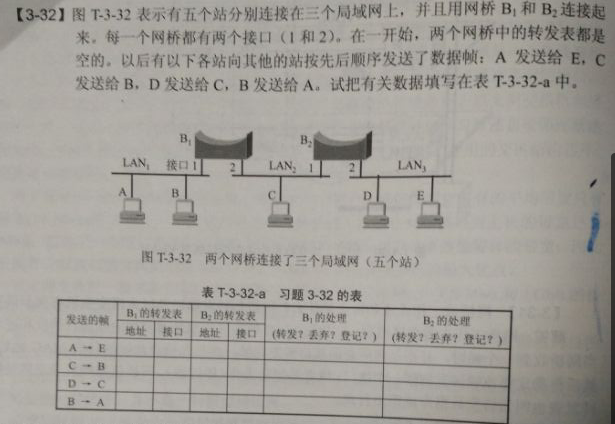
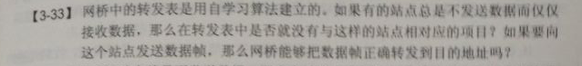
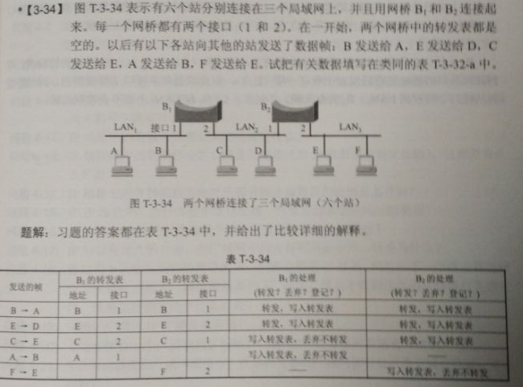

# Homework for the 9th

#### 作业

第一题：在传统10Mb/s的以太网中采用的CSMA/CD协议中，
  （1）给出CSMA/CD介质访问控制协议的数据帧发送和接收过程（可用流程图描述）；
  （2）为什么会发生冲突？CSMA/CD采用何种措施来解决冲突？
  （3）为什么会产生帧碎片？怎样滤除帧碎片？
（4）在10Mb/s的以太网中，为满足CSMA/CD协议最小帧长限制（最小帧长为64个字节），试计算电缆的最大长度为多少？（仅考虑线路上信号平均传播速度，信号平均传播速度为）
（5）10Mbps的CDMA/CD局域网的结点最大距离为2Km,信号在传输介质中传播速度为，该网络的最短帧长为多少？

第二题：

第三题：

第四题:

See [Mingzhe's implementation](https://github.com/DuNGEOnmassster/Computer_Network_Homework/tree/mingzhe/Homework9) and [Zhengbao's implementation](https://github.com/DuNGEOnmassster/Computer_Network_Homework/tree/zhengbao/Homework9)